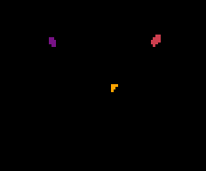

# app-CIT168Parc
This app generates a subject-specific parcellation of subcortical areas using the CIT168 parcellation.

### Authors
- Daniel Bullock (dnbulloc@iu.edu)

### Contributors
- Soichi Hayashi (hayashis@iu.edu)

### Project Director
- Franco Pestilli (franpest@indiana.edu)

### Funding

### References 
[Avesani, P., McPherson, B., Hayashi, S. et al. The open diffusion data derivatives, brain data upcycling via integrated publishing of derivatives and reproducible open cloud services. Sci Data 6, 69 (2019).](https://doi.org/10.1038/s41597-019-0073-y)

[Pauli, W., Nili, A. & Tyszka, J. A high-resolution probabilistic in vivo atlas of human subcortical brain nuclei. Sci Data 5, 180063 (2018).](https://doi.org/10.1038/sdata.2018.63)  

[human subcortical brain nuclei atlas](https://identifiers.org/neurovault.collection:3145)  

(**Note**, [atlaskit](https://github.com/jmtyszka/atlaskit/wiki) presumes a 4D structured probabalistic atlas.  As such, local machine users will need to use [fslmerge](https://fsl.fmrib.ox.ac.uk/fsl/fslwiki/Fslutils) on the separated, 3D atlas volumes in order to make a 4D atlas.

[**atlaskit**](https://github.com/jmtyszka/atlaskit/wiki)

## Running the App 

### On Brainlife.io

Visit https://doi.org/10.25663/brainlife.app.449 to run this app on the brainlife.io platform.  Requires a T1 structural image as input.

### Running Locally (on your machine) using singularity & docker

Because there is a docker container for appropriate for this code you can run this on singularity, and thereby download the repo and run it locally with minimal setup.  Ensure that you have singularity installd appropriately on your machine.

### Running Locally (on your machine)

Pull this (app-CIT168Parc) repo.

Ensure the appropriate software is installed on your local machine
| Software | Description                  | Version | Link                            |
|----------|------------------------------|---------|---------------------------------|
| Python   | High-level coding            | 3.4+    | https://www.python.org/         |
| FSL      | Neuroimaging analysis        | 5.0.9+  | https://fsl.fmrib.ox.ac.uk/     |
| ANTs     | Image warp registration      | 2.1.0+  | https://github.com/stnava/ANTs/ |
| CIT168   | Templates and atlas          | 1.0.0 ? | https://identifiers.org/neurovault.collection:3145 |

Utilize a config.json setup that is analagous to the one contained within this repo, listed as a sample.

### Sample Datasets

Visit brainlife.io and explore any data set containg T1 data:

[Human Connectome Project 3T](https://brainlife.io/project/5941a225f876b000210c11e5/detail)

## Output

This app outputs a [parcellation type](https://brainlife.io/datatype/5c1a7489f9109beac4a88a1f) data output

#### Product.json

Not relevant for this App as it does not generate processed data. 

### Dependencies

This Dockerized App only requires [singularity](https://www.sylabs.io/singularity/) and (in some cases) run. If you don't have singularity, you will need to install following dependencies.  

https://singularity.lbl.gov/docs-installation
https://surfer.nmr.mgh.harvard.edu/fswiki/DownloadAndInstall

Ensure the appropriate software is installed on your local machine
| Software | Description                  | Version | Link                            |
|----------|------------------------------|---------|---------------------------------|
| Python   | High-level coding            | 3.4+    | https://www.python.org/         |
| FSL      | Neuroimaging analysis        | 5.0.9+  | https://fsl.fmrib.ox.ac.uk/     |
| ANTs     | Image warp registration      | 2.1.0+  | https://github.com/stnava/ANTs/ |
| CIT168   | Templates and atlas          | 1.0.0 ? | https://identifiers.org/neurovault.collection:3145 |
 

